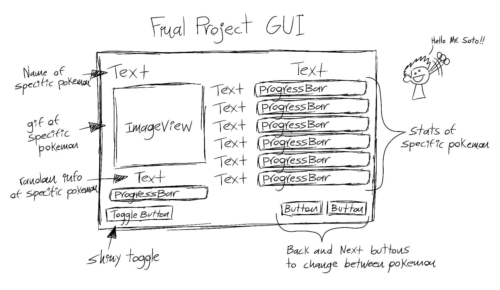

# Final Project GUI
Modify this file to contain a description of your project, as well as your GUI wireframe images. You can add them to your project directory and use a relative path.

Use [Markdown](https://www.markdownguide.org/basic-syntax) to format appropriately.
## Final Project Description
_For my final project I will be making a Pokedex which will display not only the Pokemon and its name
but also their stats, information like weigth and gender ratio, and will allow you to check their shiny, 
mega evolution, and their gender differences._

## GUI Wireframe
_Embed your wireframe image(s) here! Here is an example_

